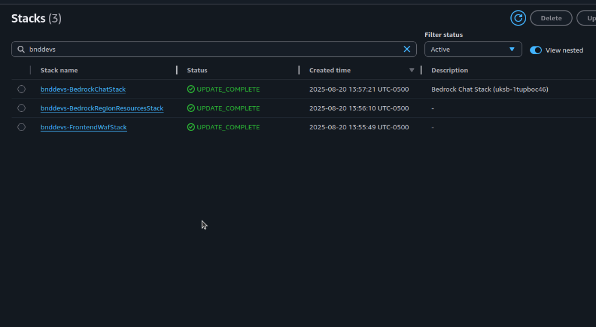
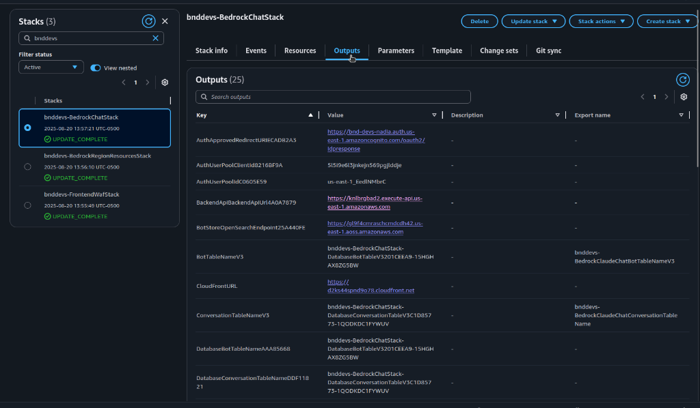
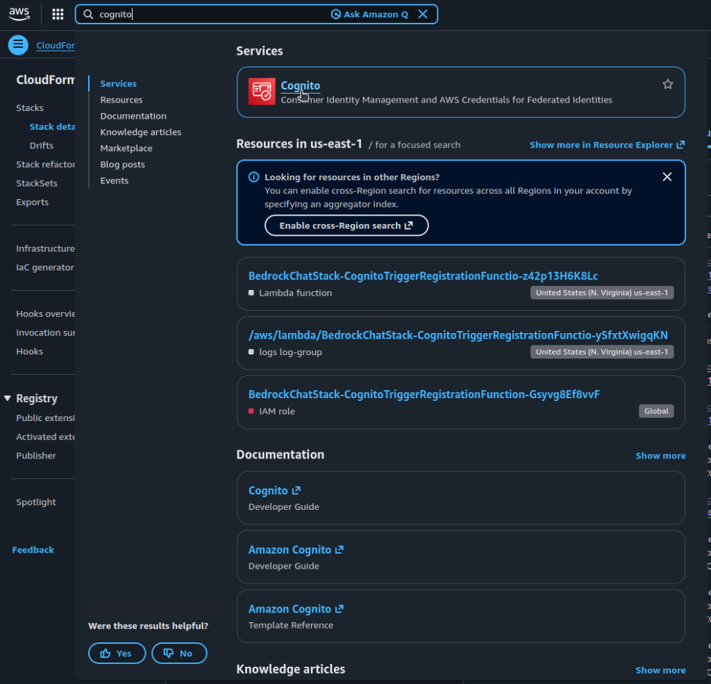
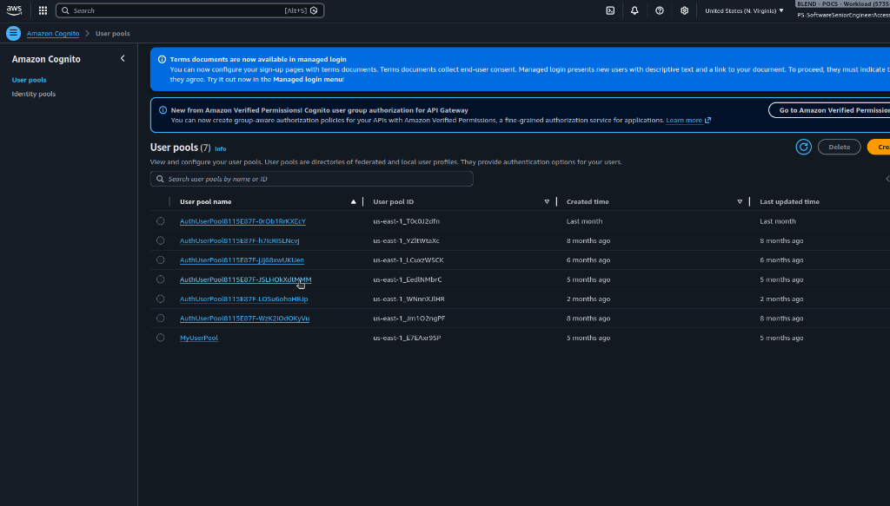
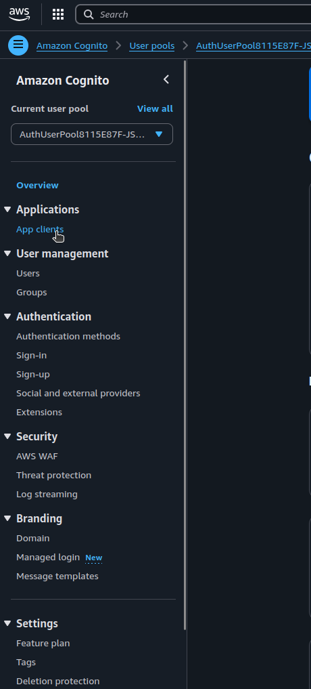
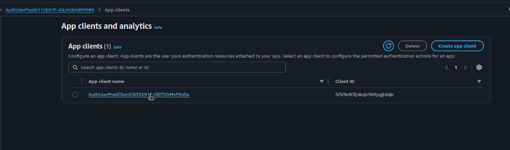
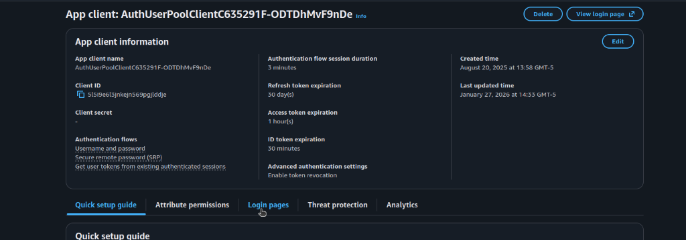
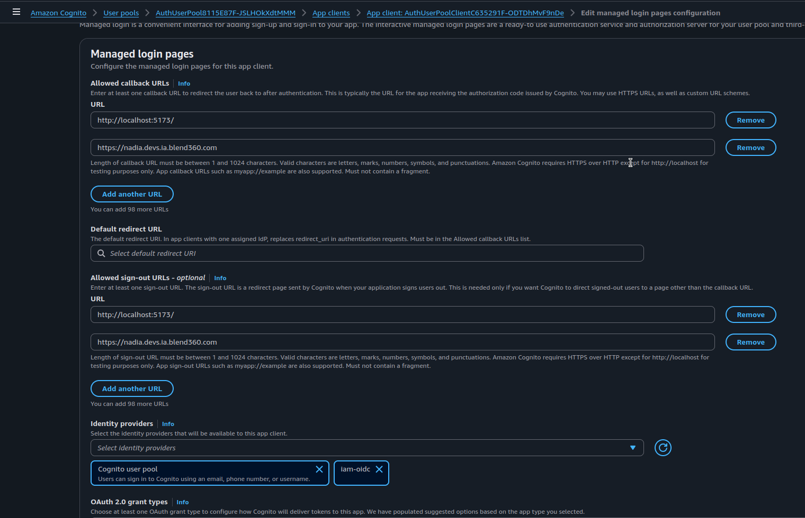
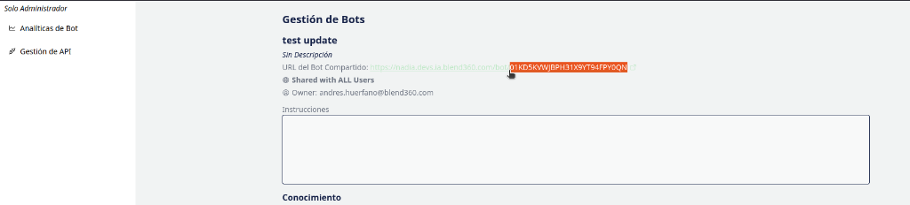

# Manual de Ejecución en Local - Nadia

Este manual describe todos los modos de desarrollo para ejecutar Nadia localmente. Está diseñado para desarrolladores nuevos que no conocen el proyecto, simplificando la complejidad de configuración.

---

## Tabla de Contenidos

- [Requisitos Previos](#requisitos-previos)
- [Obtener Valores de CloudFormation](#obtener-valores-de-cloudformation)
- [Frontend](#frontend)
- [Backend](#backend)
- [Backend Solo (Sin Frontend)](#backend-solo-sin-frontend)
- [Modo API Publicada](#modo-api-publicada)
- [Ejecución Simultánea (Frontend + Backend)](#ejecución-simultánea-frontend--backend-local)
- [Configuración VSCode para bnddevs](#configuración-vscode-para-bnddevs)
- [Configuración por Terminal](#configuración-por-terminal)
- [Troubleshooting](#troubleshooting)
- [Despliegue con CDK](#despliegue-desde-cdk)

---

## Requisitos Previos

- **Python 3.12+** (cambiar `^3.13.0` → `^3.12.0` en `pyproject.toml`)
- **Node.js 18+** y npm
- **Poetry** para Python
- **Credenciales AWS** con acceso a DynamoDB, S3, Cognito, Bedrock

---

## Obtener Valores de CloudFormation

Antes de configurar el proyecto, necesitas obtener los valores de los recursos desplegados en AWS. Estos valores están disponibles en los **Outputs** de CloudFormation.

### Paso 1: Acceder a CloudFormation

1. Ir a la [Consola de CloudFormation](https://console.aws.amazon.com/cloudformation/)
2. En el buscador, filtrar por el prefijo del ambiente (ej: `bnddevs`)
3. Verás 3 stacks principales:
   - `<prefijo>-BedrockChatStack` - Stack principal con la mayoría de recursos
   - `<prefijo>-BedrockRegionResourcesStack` - Recursos de Bedrock
   - `<prefijo>-FrontendWafStack` - WAF del frontend



### Paso 2: Obtener los Outputs

1. Hacer clic en el stack `<prefijo>-BedrockChatStack`
2. Ir a la pestaña **Outputs**
3. Aquí encontrarás todos los valores necesarios para configurar el desarrollo local



### Mapeo de Outputs a Variables de Entorno

| Output en CloudFormation             | Variable de Entorno          | Descripción                         |
| ------------------------------------ | ---------------------------- | ----------------------------------- |
| `ConversationTableNameV3`            | `CONVERSATION_TABLE_NAME`    | Tabla DynamoDB de conversaciones    |
| `BotTableNameV3`                     | `BOT_TABLE_NAME`             | Tabla DynamoDB de bots              |
| `AuthUserPoolIdC0605E59`             | `USER_POOL_ID`               | ID del User Pool de Cognito         |
| `AuthUserPoolClientId8216BF9A`       | `CLIENT_ID`                  | ID del App Client de Cognito        |
| `DocumentBucketName`                 | `DOCUMENT_BUCKET`            | Bucket S3 para documentos           |
| `LargeMessageBucketName`             | `LARGE_MESSAGE_BUCKET`       | Bucket S3 para mensajes grandes     |
| `TableAccessRoleArn`                 | `TABLE_ACCESS_ROLE_ARN`      | ROL IAM para acceso a tablas        |
| `BotStoreOpenSearchEndpoint25A440FE` | `OPENSEARCH_DOMAIN_ENDPOINT` | Endpoint de OpenSearch              |
| `BackendApiBackendApiUrl4A0A7879`    | `VITE_APP_API_ENDPOINT`      | URL del API Gateway                 |
| `WebSocketWebSocketEndpointF298FA8F` | `VITE_APP_WS_ENDPOINT`       | URL del WebSocket                   |
| `FrontendCognitoDomain9DFD4A43`      | `VITE_APP_COGNITO_DOMAIN`    | Dominio de Cognito (sin `https://`) |

### Obtener por CLI

```bash
# Listar todos los outputs del stack
aws cloudformation describe-stacks \
  --stack-name <PREFIJO>-BedrockChatStack \
  --query 'Stacks[0].Outputs' \
  --output table

# Ejemplo para bnddevs:
aws cloudformation describe-stacks \
  --stack-name bnddevs-BedrockChatStack \
  --query 'Stacks[0].Outputs' \
  --output table
```

---

## Frontend

### 1. Instalación

```bash
cd frontend/
npm ci
```

### 2. Variables de Entorno

Crear `frontend/.env.local`:

```bash
# === API Endpoints ===
# Backend REMOTO (AWS):
VITE_APP_API_ENDPOINT="<BackendApiUrl de CloudFormation>"
VITE_APP_WS_ENDPOINT="<WebSocketEndpoint de CloudFormation>"

# Backend LOCAL:
# VITE_APP_API_ENDPOINT="http://localhost:8000"
# VITE_APP_WS_ENDPOINT=""

# === Cognito ===
VITE_APP_USER_POOL_ID="<UserPoolId de CloudFormation>"
VITE_APP_USER_POOL_CLIENT_ID="<UserPoolClientId de CloudFormation>"
VITE_APP_REGION="us-east-1"

# === OAuth/OIDC ===
VITE_APP_REDIRECT_SIGNIN_URL="http://localhost:5173/"
VITE_APP_REDIRECT_SIGNOUT_URL="http://localhost:5173/"
# ⚠️ SIN "https://" - solo el dominio
VITE_APP_COGNITO_DOMAIN="<CognitoDomain de CloudFormation sin https://>"

# === IAM-OIDC (Keycloak) ===
VITE_APP_USE_STREAMING="true"
VITE_APP_SOCIAL_PROVIDERS=""
VITE_APP_CUSTOM_PROVIDER_ENABLED="true"
VITE_APP_CUSTOM_PROVIDER_NAME="iam-oidc"
```

### 3. Configurar Cognito (Primera vez)

Para que el frontend local pueda autenticarse, debes añadir `http://localhost:5173/` como Callback URL en Cognito. Puedes hacerlo de dos formas:

#### Opción A: Por Consola AWS (Manual)

**Paso 1:** Buscar Cognito en la consola de AWS



**Paso 2:** Seleccionar el User Pool

El User Pool ID lo puedes obtener de CloudFormation (`AuthUserPoolId`) o buscando por el nombre del pool que corresponda a tu ambiente.



**Paso 3:** Ir a App clients

En el menú lateral, expandir **Applications** y hacer clic en **App clients**.



**Paso 4:** Seleccionar el App Client

Hacer clic en el nombre del App Client para ver su configuración.



**Paso 5:** Editar Login Pages

1. Ir a la pestaña **Login pages**
   
2. Hacer clic en **Edit**
3. En **Allowed callback URLs**, añadir: `http://localhost:5173/`
4. En **Allowed sign-out URLs**, añadir: `http://localhost:5173/`
   
5. Guardar cambios

#### Opción B: Por CLI

```bash
aws cognito-idp update-user-pool-client \
  --user-pool-id <USER_POOL_ID> \
  --client-id <CLIENT_ID> \
  --callback-urls "<FrontendURL de producción>" "http://localhost:5173/" \
  --logout-urls "<FrontendURL de producción>" "http://localhost:5173/" \
  --supported-identity-providers "iam-oidc" "COGNITO" \
  --allowed-o-auth-flows code \
  --allowed-o-auth-scopes openid email \
  --allowed-o-auth-flows-user-pool-client \
  --region us-east-1
```

> **Nota:** Reemplaza `<USER_POOL_ID>` y `<CLIENT_ID>` con los valores de CloudFormation. Mantén las URLs de producción existentes al añadir localhost.

### 4. Configurar Keycloak (Primera vez)

Añadir a **Valid redirect URIs** del cliente en Keycloak:
```
<ApprovedRedirectURI de CloudFormation>
```

### 5. Ejecución

```bash
npm run dev
```

Frontend: `http://localhost:5173/`

---

## Backend

### 1. Instalación

```bash
cd backend/
python3.13 -m venv .venv
source .venv/bin/activate
pip install poetry
poetry lock && poetry install
```

### 2. Variables de Entorno

| Variable                      | Descripción          | Dónde obtenerla                               |
| ----------------------------- | -------------------- | --------------------------------------------- |
| `CONVERSATION_TABLE_NAME`     | Tabla conversaciones | CloudFormation → `ConversationTableNameV3`    |
| `BOT_TABLE_NAME`              | Tabla bots           | CloudFormation → `BotTableNameV3`             |
| `ACCOUNT`                     | ID cuenta AWS        | `aws sts get-caller-identity --query Account` |
| `REGION`                      | Región AWS           | `us-east-1`                                   |
| `BEDROCK_REGION`              | Región Bedrock       | `us-east-1`                                   |
| `USER_POOL_ID`                | Cognito User Pool    | CloudFormation → `AuthUserPoolId`             |
| `CLIENT_ID`                   | Cognito Client       | CloudFormation → `AuthUserPoolClientId`       |
| `DOCUMENT_BUCKET`             | Bucket documentos    | CloudFormation → `DocumentBucketName`         |
| `LARGE_MESSAGE_BUCKET`        | Bucket mensajes      | CloudFormation → `LargeMessageBucketName`     |
| `TABLE_ACCESS_ROLE_ARN`       | Rol acceso tablas    | CloudFormation → `TableAccessRoleArn`         |
| `CORS_ALLOW_ORIGINS`          | CORS                 | `http://localhost:5173`                       |
| `OPENSEARCH_DOMAIN_ENDPOINT`  | OpenSearch           | CloudFormation → `BotStoreOpenSearchEndpoint` |
| `EMBEDDING_STATE_MACHINE_ARN` | State Machine        | CloudFormation → `EmbeddingStateMachineArn`   |

### 3. Configuración VSCode (Recomendado)

Crear `.vscode/launch.json`:

```json
{
    "version": "0.2.0",
    "configurations": [
        {
            "name": "Backend: FastAPI Local",
            "type": "debugpy",
            "request": "launch",
            "module": "uvicorn",
            "args": ["app.main:app", "--reload", "--host", "0.0.0.0", "--port", "8000"],
            "env": {
                "CONVERSATION_TABLE_NAME": "<ConversationTableNameV3 de CloudFormation>",
                "BOT_TABLE_NAME": "<BotTableNameV3 de CloudFormation>",
                "ACCOUNT": "<ID de cuenta AWS>",
                "REGION": "us-east-1",
                "BEDROCK_REGION": "us-east-1",
                "DOCUMENT_BUCKET": "<DocumentBucketName de CloudFormation>",
                "LARGE_MESSAGE_BUCKET": "<LargeMessageBucketName de CloudFormation>",
                "USER_POOL_ID": "<AuthUserPoolId de CloudFormation>",
                "CLIENT_ID": "<AuthUserPoolClientId de CloudFormation>",
                "TABLE_ACCESS_ROLE_ARN": "<TableAccessRoleArn de CloudFormation>",
                "OPENSEARCH_DOMAIN_ENDPOINT": "<BotStoreOpenSearchEndpoint de CloudFormation>",
                "CORS_ALLOW_ORIGINS": "http://localhost:5173",
                "ENABLE_BEDROCK_CROSS_REGION_INFERENCE": "true",
                "AWS_ACCESS_KEY_ID": "<tu-access-key>",
                "AWS_SECRET_ACCESS_KEY": "<tu-secret-key>",
                "AWS_SESSION_TOKEN": "<tu-session-token>"
            },
            "console": "integratedTerminal",
            "python": "${workspaceFolder}/backend/.venv/bin/python",
            "cwd": "${workspaceFolder}/backend"
        }
    ]
}
```

### 4. Ejecución

```bash
poetry run uvicorn app.main:app --reload --host 0.0.0.0 --port 8000
```

Backend: `http://localhost:8000/docs`

---

## Backend Solo (Sin Frontend)

Cuando ejecutas **solo el backend** sin el frontend, necesitas configurar un usuario de prueba ya que no hay autenticación OAuth.

### Modificar Usuario de Prueba

Editar `backend/app/main.py` en la función `add_current_user_to_request` (línea ~125):

**Código original:**
```python
request.state.current_user = User(
    id="PUBLISHED_API#01K5WCE750N5H9K90WY0KM672C",
    name="test_user",
    email="user@example.com",
    groups=[]
)
```

**Modificar según el caso de uso:**

| Caso de uso                         | Valor de `id`             | Ejemplo                                    |
| ----------------------------------- | ------------------------- | ------------------------------------------ |
| Probar conversaciones de un usuario | ID del usuario en Cognito | `64b8f498-6031-7002-7574-2683f4532c2a`     |
| Probar endpoints de API publicada   | `PUBLISHED_API#<BOT_ID>`  | `PUBLISHED_API#01K25C9XD3227C3SYTMF5NJE6N` |

> **Nota:** El ID de usuario se puede obtener desde la consola de Cognito o desde DynamoDB en la tabla de conversaciones.

---

## Modo API Publicada

El backend puede ejecutarse en **modo API publicada** para probar bots que han sido expuestos como APIs REST.

### ¿Qué es `PUBLISHED_API_ID`?

Cuando publicas un bot como API en Nadia, se genera un ID único para ese bot publicado. Este ID permite que el backend funcione en un modo especial donde:

- No requiere autenticación de usuario
- Solo expone los endpoints de la API publicada (`/published_api/*`)
- Todas las requests se asocian al bot publicado

### ¿Dónde obtener el PUBLISHED_API_ID?

#### Opción 1: Desde la UI de Nadia

1. Ir a **Admin → Gestión de API**
2. Seleccionar el bot publicado
3. El ID aparece en la URL del bot compartido (resaltado en naranja)



#### Opción 2: Desde DynamoDB

1. Ir a la [Consola de DynamoDB](https://console.aws.amazon.com/dynamodbv2/)
2. Seleccionar la tabla `<prefijo>-BedrockChatStack-DatabaseBotTable...`
3. Buscar items donde el `SK` (Sort Key) comience con `BOT#`
4. El ID del bot está en la columna `PK` o en el campo `SK` después de `BOT#`


### Configuración

Añadir la variable `PUBLISHED_API_ID` al `launch.json` o exportarla en terminal:

```json
{
    "env": {
        // ... otras variables ...
        "PUBLISHED_API_ID": "<ID del bot publicado>"
    }
}
```

### Ejemplo de `PUBLISHED_API_ID`:
```
01K25C9XD3227C3SYTMF5NJE6N
```

---

## Ejecución Simultánea (Frontend + Backend Local)

### Terminal 1: Backend
```bash
cd backend/
source .venv/bin/activate
poetry run uvicorn app.main:app --reload --host 0.0.0.0 --port 8000
```

### Terminal 2: Frontend
```bash
cd frontend/
# En .env.local cambiar:
# VITE_APP_API_ENDPOINT="http://localhost:8000"
npm run dev
```

---

## Configuración VSCode para bnddevs

Configuración lista para copiar y pegar para el ambiente de desarrollo `bnddevs`:

```json
{
    "version": "0.2.0",
    "configurations": [
        {
            "name": "Backend: FastAPI (bnddevs)",
            "type": "debugpy",
            "request": "launch",
            "module": "uvicorn",
            "args": [
                "app.main:app",
                "--reload",
                "--host",
                "0.0.0.0",
                "--port",
                "8000"
            ],
            "env": {
                "CONVERSATION_TABLE_NAME": "bnddevs-BedrockChatStack-DatabaseConversationTableV3C1D85773-1QODKDC1FYWUV",
                "BOT_TABLE_NAME": "bnddevs-BedrockChatStack-DatabaseBotTableV3201CEEA9-15HGHAX8ZG5BW",
                "ACCOUNT": "573578169450",
                "REGION": "us-east-1",
                "BEDROCK_REGION": "us-east-1",
                "DOCUMENT_BUCKET": "bnddevs-bedrockregionreso-useast1documentbucket038-ldzipylsgzhq",
                "LARGE_MESSAGE_BUCKET": "bnddevs-bedrockchatstack-largemessagebucketad0c9b6-pgpxzt2dkfzt",
                "USER_POOL_ID": "us-east-1_EedlNMbrC",
                "CLIENT_ID": "5l5i9e6l3jnkejn569pgjlddje",
                "OPENSEARCH_DOMAIN_ENDPOINT": "https://gl9f4cmraschcmdcdh42.us-east-1.aoss.amazonaws.com",
                "TABLE_ACCESS_ROLE_ARN": "arn:aws:iam::573578169450:role/bnddevs-BedrockChatStack-DatabaseTableAccessRole59A-cbJDjgMzVttr",
                "EMBEDDING_STATE_MACHINE_ARN": "arn:aws:states:us-east-1:573578169450:stateMachine:EmbeddingStateMachine79E88DC2-aEsNuSEJnoqx",
                "CORS_ALLOW_ORIGINS": "http://localhost:5173",
                "ENABLE_BEDROCK_CROSS_REGION_INFERENCE": "true",
                "AWS_ACCESS_KEY_ID": "<tu-access-key>",
                "AWS_SECRET_ACCESS_KEY": "<tu-secret-key>",
                "AWS_SESSION_TOKEN": "<tu-session-token>"
            },
            "console": "integratedTerminal",
            "python": "${workspaceFolder}/backend/.venv/bin/python",
            "cwd": "${workspaceFolder}/backend"
        }
    ]
}
```

> **Nota:** Debes actualizar `AWS_ACCESS_KEY_ID`, `AWS_SECRET_ACCESS_KEY` y `AWS_SESSION_TOKEN` con tus credenciales temporales de AWS.

---

## Configuración por Terminal

Si prefieres no usar VSCode, puedes exportar las variables de entorno directamente en la terminal:

### Exportar Variables (bnddevs)

```bash
# Variables de entorno para bnddevs
export CONVERSATION_TABLE_NAME="bnddevs-BedrockChatStack-DatabaseConversationTableV3C1D85773-1QODKDC1FYWUV"
export BOT_TABLE_NAME="bnddevs-BedrockChatStack-DatabaseBotTableV3201CEEA9-15HGHAX8ZG5BW"
export ACCOUNT="573578169450"
export REGION="us-east-1"
export BEDROCK_REGION="us-east-1"
export DOCUMENT_BUCKET="bnddevs-bedrockregionreso-useast1documentbucket038-ldzipylsgzhq"
export LARGE_MESSAGE_BUCKET="bnddevs-bedrockchatstack-largemessagebucketad0c9b6-pgpxzt2dkfzt"
export USER_POOL_ID="us-east-1_EedlNMbrC"
export CLIENT_ID="5l5i9e6l3jnkejn569pgjlddje"
export OPENSEARCH_DOMAIN_ENDPOINT="https://gl9f4cmraschcmdcdh42.us-east-1.aoss.amazonaws.com"
export TABLE_ACCESS_ROLE_ARN="arn:aws:iam::573578169450:role/bnddevs-BedrockChatStack-DatabaseTableAccessRole59A-cbJDjgMzVttr"
export EMBEDDING_STATE_MACHINE_ARN="arn:aws:states:us-east-1:573578169450:stateMachine:EmbeddingStateMachine79E88DC2-aEsNuSEJnoqx"
export CORS_ALLOW_ORIGINS="http://localhost:5173"
export ENABLE_BEDROCK_CROSS_REGION_INFERENCE="true"

# Credenciales AWS (reemplazar con tus credenciales)
export AWS_ACCESS_KEY_ID="<tu-access-key>"
export AWS_SECRET_ACCESS_KEY="<tu-secret-key>"
export AWS_SESSION_TOKEN="<tu-session-token>"
```

### Ejecutar Backend

```bash
cd backend/
source .venv/bin/activate
poetry run uvicorn app.main:app --reload --host 0.0.0.0 --port 8000
```

### Script de Inicio Rápido

Puedes crear un archivo `start-backend.sh`:

```bash
#!/bin/bash
# Cargar variables de entorno
source .env.backend

# Activar virtualenv e iniciar
source .venv/bin/activate
poetry run uvicorn app.main:app --reload --host 0.0.0.0 --port 8000
```

---

## Troubleshooting

| Error                        | Causa                          | Solución                                 |
| ---------------------------- | ------------------------------ | ---------------------------------------- |
| `https://https//...`         | COGNITO_DOMAIN tiene protocolo | Quitar `https://` del valor              |
| `redirect_mismatch`          | URL no registrada en Cognito   | Añadir a Callback URLs en Cognito        |
| `RedirectUri not registered` | URL no registrada en Keycloak  | Añadir `oauth2/idpresponse` a Keycloak   |
| Usuario mock en vez de real  | Falta Authorization header     | Frontend debe enviar token JWT           |
| `InvalidClientTokenId`       | Credenciales AWS inválidas     | Renovar credenciales con `aws sso login` |
| `Table not found`            | Variables mal configuradas     | Verificar outputs de CloudFormation      |

---

## Resumen de Comandos Rápidos

### Backend
```bash
cd backend/
python3.13 -m venv .venv
source .venv/bin/activate
pip install poetry
poetry lock && poetry install
poetry run uvicorn app.main:app --reload --host 0.0.0.0 --port 8000
```

### Frontend
```bash
cd frontend/
npm ci
npm run dev
```

---

## ⚠️ Importante para Despliegue

Antes del despliegue:
1. Revertir todos los cambios en archivos de configuración del backend (`pyproject.toml`)
2. Eliminar el ambiente virtual `.venv/`
3. Eliminar la carpeta `.vscode/`
4. **NO** commitear `.env.local`

---

## Despliegue desde CDK

Para desplegar Nadia se utiliza la funcionalidad de generar diferentes ambientes desde la misma cuenta de AWS, permitiendo disponibilizar múltiples instancias de Nadia.

### 1. Configurar el ambiente

Editar `cdk/parameter.ts` y agregar un objeto con las variables del ambiente:

```ts
bedrockChatParams.set("Tag del ambiente", {
  identityProviders: [
    {
      "service": "oidc",
      "serviceName": "iam-oidc",
      "secretName": "Secreto con el cliente de Nadia generado en el IAM"
    }
  ],
  userPoolDomainPrefix: "cliente-ambiente-nadia",
  bedrockRegion: "us-east-1",
  allowedSignUpEmailDomains: [
    "nuvu.cc",
    "blend360.com",
    "dominio de email del cliente que va a usar Nadia"
  ],
  autoJoinUserGroups: [],
  alternateDomainName: "url de acceso a Nadia",
  hostedZoneId: "id de la hosted zone donde se hospedará la URL de Nadia",
});
```

### 2. Despliegue

```bash
# 1. Ir a la carpeta CDK
cd cdk/

# 2. Configurar credenciales AWS
# (usar aws-vault, aws sso login, o exportar variables)

# 3. Bootstrap (solo primera vez)
npx cdk bootstrap -c envName=<tag-del-ambiente>

# 4. Desplegar
npx cdk deploy --all --require-approval never -c envName=<tag-del-ambiente>
```

### Ejemplo para ambiente `bnddevs`:
```bash
npx cdk bootstrap -c envName=bnddevs
npx cdk deploy --all --require-approval never -c envName=bnddevs
```